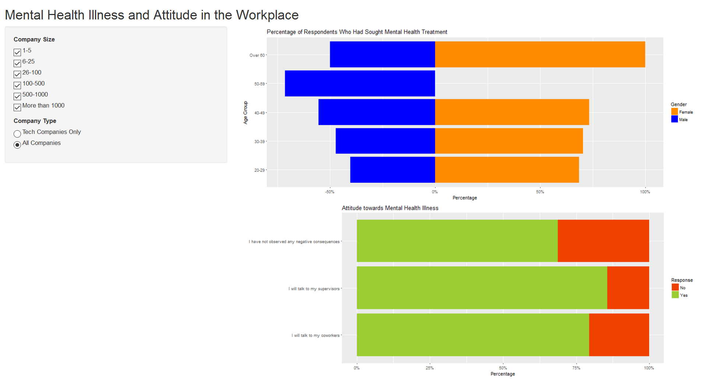

# Mental Health Explorer

## Overview
According to a 2012 study by the Canadian government, mental illness leads to more than 6 billion dollars in lost productivity in 2011. Therefore, the goal of this data visualization app is to help businesses decide if various mental health programs are effective in reducing mental health-related treatment and encouraging a culture of acceptance.

## Description of Data
The dataset is from a 2014 [survey](https://www.kaggle.com/osmi/mental-health-in-tech-survey) that measures attitudes towards mental health and frequency of mental health disorders in the tech workplace.

## Description of App
On the left is the control panel with the title of the app on the top. Below the title are the filters: by company type and number of employees. To the right of the control panel is the visualization area. There will be two different graphs:
1. Treatment: a bar chart showing the percentage of respondents who claim they have sought mental health treatment, grouped by age and gender

2. Attitude: shows the percentage of respondents that would be willing to discuss a mental health issue with coworkers, supervisors, who have heard of or observed negative consequences for coworkers with mental health conditions.

## App
